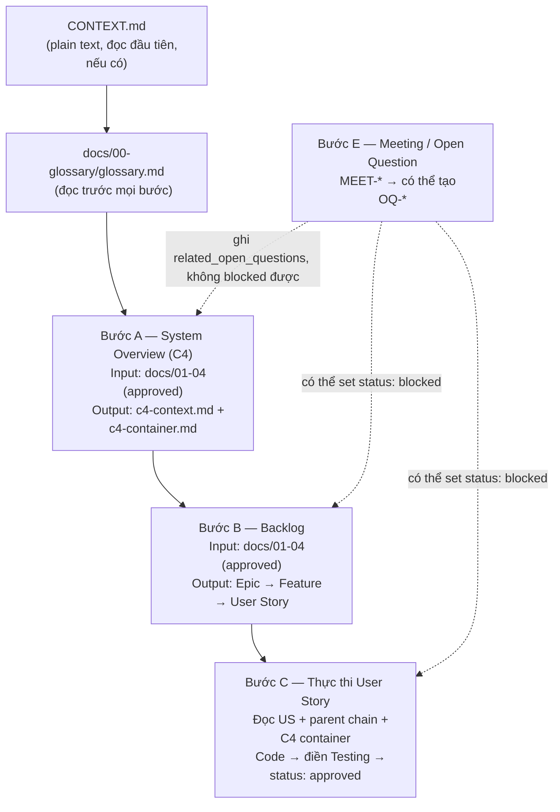
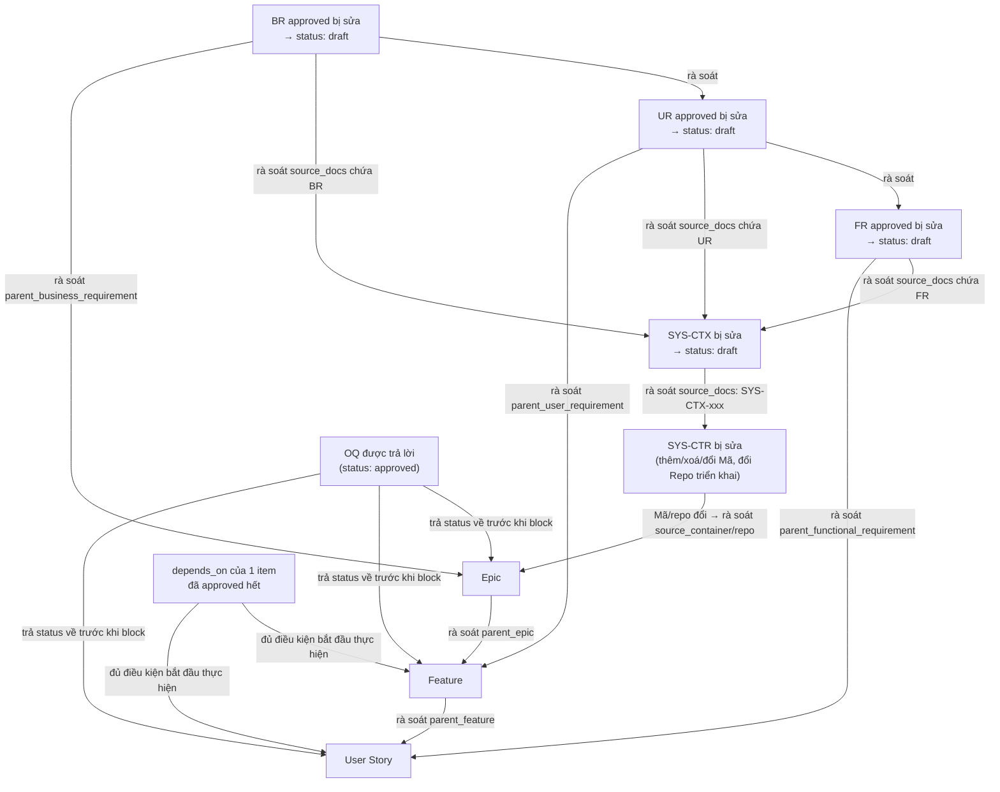

# AGENTS.md — Hướng dẫn cho Agent khi làm việc với Spec Kit này

## Nguyên tắc chung
1. LUÔN đọc `CONTEXT.md` và `docs/00-glossary/glossary.md` trước khi xử lý bất kỳ tài liệu nào — `CONTEXT.md` giới thiệu kit + thành phần chính, không phải nơi nháp WHY/WHO/WHAT (dùng skill `setup-context` để ghi thẳng vào BR/UR/FR).
2. KHÔNG bỏ qua tầng ở docs/01-04: chỉ sinh tài liệu ở tầng N+1 khi tài liệu tầng N có
   `status: approved` (BR → UR → FR → System Overview — xem bảng vòng đời status ở
   `CLAUDE.md`). Tầng backlog (Epic → Feature → User Story) KHÔNG bị chặn bởi status của tầng
   cha — được phép thêm Feature/User Story mới vào một Epic/Feature đang `draft` bất kỳ lúc nào
   (backlog grooming là việc liên tục), miễn `parent_*` trỏ đúng và `status: deprecated` thì
   không thêm con mới nữa.
3. Mọi tài liệu mới phải điền đủ frontmatter (id, type, status, version, parent_*).
4. Nếu một item liên quan tới `OQ-xxx` chưa được trả lời (`status: draft`), set
   `status: blocked` thay vì tiếp tục.
5. Spec-kit này dừng ở User Story — không có tầng Task kỹ thuật, Sprint, hay Release riêng.
   Việc chia nhỏ hơn nữa, lên lịch, branching, và release là việc của repo triển khai (gắn với
   tech stack + công cụ PM riêng từng container) — xem "Làm việc đa repo" phía dưới.

## Quy trình theo bước

### Bước A — Sinh System Overview (C4)
Input: toàn bộ `docs/01-business-requirement`, `01-user-requirement`, `02-functional-requirement`
(status = approved).
Output: `docs/04-system-overview/c4-context.md` và `c4-container.md`.
Không sinh Component/Code diagram trừ khi được yêu cầu rõ ràng.

### Bước B — Sinh Backlog
Input: `docs/01-04` (đã approved).
Output theo thứ tự: Epic → Feature → User Story, mỗi cấp dùng đúng template
trong `docs/05-backlog/*/`. Liên kết `parent_*` bắt buộc. Epic nằm phẳng trong
`docs/05-backlog/epics/`; Feature/User Story nằm trong subfolder theo Epic sở hữu (xem
`CLAUDE.md`, mục "Đặt tên, ID và versioning") — không tạo phẳng chung 1 thư mục.

**Tiêu chí phân rã từng cấp** — dùng để quyết định một ý tưởng nên là Epic, Feature, hay
User Story:

| Cấp | Trả lời câu hỏi | Quy mô điển hình | `parent_*` bắt buộc | Ai review |
|---|---|---|---|---|
| Epic | Mục tiêu kinh doanh lớn nào (từ 1 BR) đang được hiện thực hoá? 1 Epic ≈ 1 mảng giá trị lớn, ứng với 1 container triển khai (`source_container` + `repo`) | Nhiều Feature, thường ~5-20 Feature | `parent_business_requirement` | Product owner / tech lead |
| Feature | Epic này gồm những nhóm chức năng con nào? | Vài User Story | `parent_epic`, `parent_user_requirement` | Product owner |
| User Story | Persona cụ thể nào (từ UR) cần làm gì, để được lợi ích gì? Đủ nhỏ để 1 người triển khai xong trong 1 lần thay đổi mạch lạc, phải có Acceptance Criteria | Vài giờ đến vài ngày | `parent_feature`, `parent_functional_requirement` | Dev nhận User Story / tech lead |

Nếu 1 Epic vượt xa mức ~20 Feature, đó là dấu hiệu Epic đang gộp nhiều mảng giá trị khác nhau
— tách thành nhiều Epic nhỏ hơn, cùng trỏ `parent_business_requirement` về BR gốc (và cùng
`source_container` nếu vẫn chung 1 hệ thống), thay vì giữ 1 Epic khổng lồ.

**User Story đủ nhỏ để dễ test là thế nào?** Vì User Story là đơn vị thực thi cuối cùng (không
còn tầng Task để tách tiếp), dùng 3 dấu hiệu cụ thể sau để quyết định có cần tách User Story
tiếp không:
1. 1 User Story = 1 hành vi cụ thể, triển khai được trong 1 lần thay đổi mạch lạc. Mô tả phải
   nối nhiều hành vi bằng "và"/"rồi" → tách thành nhiều User Story.
2. Phải viết được ít nhất 1 test case cụ thể (Input → Expected output) ngay lúc tạo User Story,
   điền thẳng vào bảng "Testing" của `US-template.md` — không hình dung được test case cụ thể
   nghĩa là User Story còn mơ hồ hoặc còn quá lớn, hỏi lại user hoặc tách tiếp trước khi tạo.
3. Definition of Done chỉ nên xoay quanh 1 nhóm tiêu chí liên quan — nhiều nhóm không liên
   quan tới nhau (vừa "thêm API" vừa "cập nhật UI" vừa "viết doc") là dấu hiệu đang gộp việc.

**Phụ thuộc giữa Feature/User Story** (khác với `blocked_by_open_questions`): field
`depends_on` trên Feature/US ghi ID của (các) item khác phải `status: approved` trước khi
item này được coi là thực hiện được. Đây không phải trạng thái `blocked` — không cần
`blocked_by_open_questions`, không cần ai quyết định gì, chỉ đơn giản là "chưa tới lượt" và tự
hết khi dependency xong. Không bắt đầu thực hiện (Bước C) một User Story khi `depends_on` của
nó còn ID chưa `approved`.

**Epic ứng với container/repo nào?** Không tự đặt mã/tên repo mới ở bước này — số lượng và mã
hệ thống đã được chốt từ Bước A (`c4-container.md`, cột "Mã"). Đối chiếu "Mục tiêu" của Epic
với cột "Trách nhiệm" của từng container trong bảng đó:
- Khớp đúng 1 container → lấy "Mã" của container đó cho `source_container`, và giá trị ở cột
  "Repo triển khai" cho field `repo` của Epic.
- Khớp Trách nhiệm của nhiều container (Epic cần nhiều hệ thống phối hợp) → tách thành nhiều
  Epic, mỗi Epic ứng với 1 `source_container`, cùng trỏ `parent_business_requirement` về BR gốc.
- Không container nào khớp → `c4-container.md` đang thiếu/lỗi thời, quay lại Bước A cập nhật
  container diagram trước, không tự bịa repo ở backlog.

**"Backlog"** không phải 1 file riêng — đó là trạng thái gộp của mọi Epic/Feature/User Story
trong `docs/05-backlog` đang `draft` và không `blocked` (chưa `approved` nghĩa là chưa xong).
Ưu tiên xử lý: loại các item đang `blocked` trước, còn lại sắp theo field `priority` trên
Feature/US (`P0` xử lý trước, `P3` sau cùng).

**`priority` khác gì với "Ưu tiên" (MoSCoW) ở UR?** Hai lớp riêng biệt, không dùng thay cho
nhau:
- MoSCoW ở UR (`Must/Should/Could/Won't have`) là ưu tiên **của yêu cầu**, chốt 1 lần lúc UR
  được approve, hiếm khi đổi.
- `priority` (`P0`-`P3`) trên Feature/User Story là ưu tiên **xử lý trong backlog**, có thể
  khác giá trị suy ra từ MoSCoW gốc vì bối cảnh thay đổi (deadline khách hàng, rủi ro kỹ thuật
  mới phát sinh...).

Khi tạo mới Feature/US ở Bước B, suy `priority` mặc định từ mức MoSCoW của UR nguồn: `Must
have` → `P0`/`P1`, `Should have` → `P1`/`P2`, `Could have` → `P2`/`P3`, `Won't have` → không
đưa vào backlog. Review định kỳ `priority` của các item đang `draft` (chưa `approved`) — có
thể điều chỉnh nếu bối cảnh thực tế khác lúc tạo, nhưng phải ghi lý do đổi vào mục "Ghi chú"/
"Ghi chú kỹ thuật" của item đó.

**Ví dụ minh hoạ** (một luồng xuyên suốt, rút gọn):
`BR-001` "Tăng tỉ lệ chuyển đổi checkout" → `UR-001` "Khách hàng mua sắm online, pain point:
phải nhập lại thông tin thẻ mỗi lần mua" → `FR-001` "Hệ thống phải hỗ trợ thanh toán 1-click
cho thẻ đã lưu" → `EPIC-001` "Checkout nhanh" (`repo: checkout-service`) → `FEAT-001` "Thanh
toán 1-click" → `US-001` "Là khách hàng đã lưu thẻ, tôi muốn thanh toán 1 chạm để không phải
nhập lại thông tin" (Acceptance Criteria + Testing điền ngay lúc tạo). Khi `US-001` đã `draft`,
đủ rõ để làm và không `blocked`, agent (hoặc dev) bắt đầu thực hiện (Bước C).

### Bước C — Thực thi User Story
Trước khi code, agent đọc theo thứ tự:
1. `docs/00-glossary/glossary.md`
2. File User Story hiện tại — mục "Context cho Agent" nếu có (US tạo trước khi mục này có
   trong template có thể chưa có; khi đó đi thẳng bước 3)
3. `parent_feature` → `parent_functional_requirement`
4. `docs/04-system-overview/c4-container.md` (container liên quan)
Sau khi code xong: điền bảng Testing trong User Story (nếu US chưa có mục này, thêm vào theo
đúng cấu trúc `US-template.md` trước khi điền), chỉ set `status: approved` khi mọi test case
PASS.

### Bước E — Xử lý Meeting/Open Question
Khi có input từ cuộc họp: tạo `MEET-*`, nếu phát sinh điều chưa rõ → tạo `OQ-*`
(`status: draft`) và cập nhật `blocked_by_open_questions` + `status: blocked` trên các
Epic/Feature/Story liên quan (SYS-CTX/SYS-CTR không có `blocked` — chỉ ghi
`related_open_questions`, không tự chặn tiến độ, xem `CLAUDE.md`).
Không tự suy đoán câu trả lời cho open question — chỉ ghi nhận. Khi OQ được trả lời: điền
mục "Trả lời" trong `OQ-xxx`, set `status: approved`, rồi gỡ block trên mọi item liệt kê
trong `blocks: []` của OQ đó — đưa `status` của từng item quay về trạng thái **trước khi bị
block** (không mặc định về `draft`; xem `OQ-template.md`). Item bị block có thể là
Epic/Feature/Story.

**Họp làm thay đổi Feature/User Story** — phân biệt 2 trường hợp:
- Thay đổi **chưa chốt**, còn cần quyết định → xử lý như open question bình thường ở trên: tạo
  `OQ-*`, set `blocked_by_open_questions` + `status: blocked` trên item liên quan.
- Thay đổi **đã chốt ngay tại họp** (không cần OQ) → sửa thẳng Feature/User Story bị ảnh hưởng
  (tăng `version`, cập nhật `last_updated`), ghi lý do + liên kết `MEET-xxx` vào mục "Ghi chú"/
  "Ghi chú kỹ thuật" của item đó:
  - Item vẫn `draft` (chưa thực hiện xong) → sửa thẳng nội dung cho khớp.
  - Item đã `approved` (đã thực hiện xong) → KHÔNG sửa ngược item đã hoàn thành (phá
    traceability của việc đã xong); tạo Feature/User Story mới cho phần chênh lệch,
    `parent_*` trỏ về đúng Epic/Feature liên quan.

## Ma trận lan truyền thay đổi

Không có cơ chế tự động (không hook, không CI) — mọi lan truyền dưới đây đều cần agent/người
chủ động rà soát khi thấy 1 tài liệu chuyển sang trạng thái kích hoạt (`draft` trở lại sau
`approved`, `blocked`, container đổi Mã, OQ được trả lời, `depends_on` hoàn tất...). Sơ đồ này
chỉ để tra cứu nhanh "sửa cái này thì phải xem lại cái gì" — không thay thế nội dung chi tiết
ở Bước A–C, E phía trên.

| Nguồn thay đổi | Cần rà soát/cập nhật | Chi tiết ở đâu |
|---|---|---|
| BR đã `approved` bị sửa nội dung → `status: draft` | UR con (`parent_business_requirement`), SYS-CTX có `source_docs` chứa BR đó, Epic có `parent_business_requirement` trỏ tới BR đó | Nguyên tắc chung #2; sau khi rà soát xong mới đưa BR về lại `approved` |
| UR đã `approved` bị sửa → `status: draft` | FR con, SYS-CTX (`source_docs`), Feature (`parent_user_requirement`) | như trên |
| FR đã `approved` bị sửa → `status: draft` | SYS-CTX (`source_docs`), User Story (`parent_functional_requirement`) | như trên |
| SYS-CTX đã `approved` bị sửa → `status: draft` | SYS-CTR có `source_docs: [SYS-CTX-xxx]` | Bước A |
| SYS-CTR đổi (thêm/xoá/đổi Mã hoặc Repo triển khai của 1 container) | Epic có `source_container` trỏ tới Mã đó — cập nhật lại `source_container`/`repo`, hoặc báo "liên kết gãy" nếu Mã bị xoá | Bước B, mục "Epic ứng với container/repo nào?" |
| Feature/User Story đổi trong cuộc họp | User Story liên quan — còn `draft` thì sửa thẳng, đã `approved` thì tạo item mới cho phần chênh lệch | Bước E, mục "Họp làm thay đổi Feature/User Story" |
| OQ được trả lời (`status: approved`) | Mọi item trong `blocks: []` của OQ đó — trả `status` về trạng thái trước khi bị block | Bước E |
| `depends_on` của 1 item đã `approved` hết | Chính item đó — có thể xét bắt đầu thực hiện (Bước C, vẫn cần review, không tự động) | Bước B, mục "Phụ thuộc giữa Feature/User Story" |

## Làm việc đa repo

Kit này là repo trung tâm chứa spec/backlog; việc triển khai code có thể nằm ở (các) repo
khác — quy ước: **mỗi Epic ứng với một container/repo triển khai** (một hệ thống/service),
ghi ở field `source_container` (mã container trong `c4-container.md`) và `repo` (tên repo
tương ứng) trong frontmatter của `EPIC-xxx`.

- Repo triển khai xác định công việc của mình qua chuỗi `parent_epic` → field `repo` — chỉ
  nhận User Story thuộc Epic có `repo` trỏ đúng tên mình.
- Việc chia User Story thành task/ticket kỹ thuật cụ thể, đặt tên branch, quy ước PR, lên
  lịch (sprint), và release/deploy là việc của repo triển khai — dùng công cụ/quy ước phù hợp
  tech stack của container đó (GitHub Projects, Jira, Linear, Gitflow, trunk-based...); spec-kit
  này không áp đặt quy ước chung cho phần đó. Chỉ cần PR/commit ở repo triển khai nhắc ID
  User Story (ví dụ `US-014: ...`) để truy vết ngược.
- Sau khi User Story hoàn thành ở repo triển khai, cập nhật `status: approved` cho User Story
  đó **trong repo spec-kit này** (không tự động — repo triển khai và repo spec là hai repo khác
  nhau, phải cập nhật thủ công hoặc qua agent), và điền `external_ref` bằng link PR/commit/ticket
  liên quan.
- Không tạo lại toàn bộ backlog trong repo triển khai — repo triển khai chỉ đọc, không phải
  nguồn sự thật cho Epic/Feature/Story.
