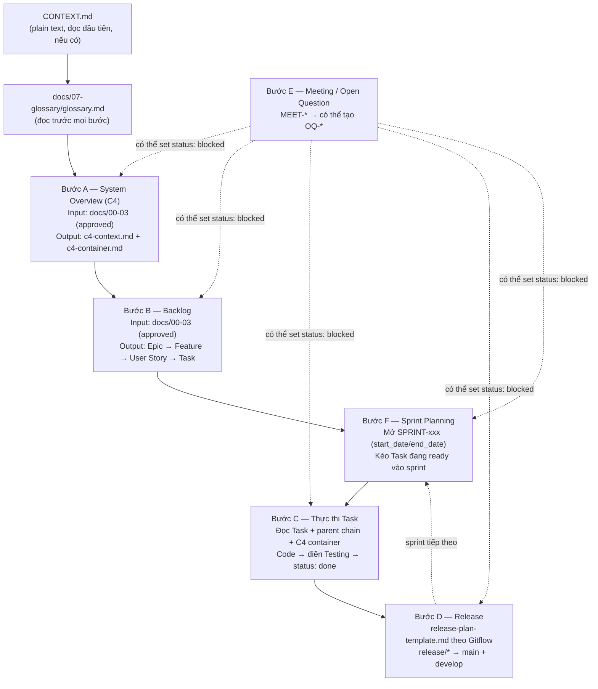

# AGENTS.md — Hướng dẫn cho Agent khi làm việc với Spec Kit này

## Nguyên tắc chung
1. LUÔN đọc `CONTEXT.md` và `docs/07-glossary/glossary.md` trước khi xử lý bất kỳ tài liệu nào — `CONTEXT.md` giới thiệu kit + thành phần chính, không phải nơi nháp WHY/WHO/HOW (dùng skill `setup-context` để ghi thẳng vào BR/UR/FR).
2. KHÔNG bỏ qua tầng: chỉ sinh tài liệu ở tầng N+1 khi tài liệu tầng N có `status: approved`
   (áp dụng giữa các tầng docs/00-03: BR → UR → FR → System Overview) hoặc `status: ready`
   (áp dụng giữa các tầng backlog: Epic → Feature → User Story → Task — xem bảng vòng đời
   status theo từng nhóm tài liệu ở `CLAUDE.md`). Quy tắc này chỉ chặn giữa các tầng, không
   chặn việc tạo Epic/Feature/User Story/Task cùng lúc ở `status: draft` trong một phiên
   `plan-backlog` (Bước B) — review/approve từng cấp vẫn là bước riêng sau đó.
3. Mọi tài liệu mới phải điền đủ frontmatter (id, type, status, version, parent_*).
4. Nếu một item liên quan tới `OQ-xxx` đang `open`, set `status: blocked` thay vì tiếp tục.

## Quy trình theo bước

### Bước A — Sinh System Overview (C4)
Input: toàn bộ `docs/00-business-requirement`, `01-user-requirement`, `02-functional-requirement`
(status = approved).
Output: `docs/03-system-overview/c4-context.md` và `c4-container.md`.
Không sinh Component/Code diagram trừ khi được yêu cầu rõ ràng.

### Bước B — Sinh Backlog
Input: `docs/00-03` (đã approved).
Output theo thứ tự: Epic → Feature → User Story → Task, mỗi cấp dùng đúng template
trong `docs/04-backlog/*/`. Liên kết `parent_*` bắt buộc.

**Tiêu chí phân rã từng cấp** — dùng để quyết định một ý tưởng nên là Epic, Feature, User
Story hay Task:

| Cấp | Trả lời câu hỏi | Quy mô điển hình | `parent_*` bắt buộc | Ai review |
|---|---|---|---|---|
| Epic | Mục tiêu kinh doanh lớn nào (từ 1 BR) đang được hiện thực hoá? 1 Epic ≈ 1 mảng giá trị lớn, có thể ứng với 1 repo triển khai (field `repo`) | Kéo dài nhiều sprint | `parent_business_requirement` | Product owner / tech lead |
| Feature | Epic này gồm những nhóm chức năng con nào? | Vài sprint | `parent_epic`, `parent_user_requirement` | Product owner |
| User Story | Persona cụ thể nào (từ UR) cần làm gì, để được lợi ích gì? Đủ nhỏ để xong trong 1 sprint, phải có Acceptance Criteria | Trong 1 sprint | `parent_feature`, `parent_functional_requirement` | Cả team lúc Sprint Planning (Bước F) |
| Task | Việc kỹ thuật cụ thể nào để hoàn thành User Story đó? Đủ nhỏ để 1 dev làm xong trong vài giờ–1-2 ngày | Giờ tới 1-2 ngày | `parent_user_story` | Dev nhận Task |

**"Backlog"** không phải 1 file riêng — đó là trạng thái gộp của mọi Epic/Feature/User
Story/Task trong `docs/04-backlog` đang `draft`/`ready` (chưa gắn vào sprint nào). Ưu tiên xử
lý: loại các item đang `blocked` trước, còn lại ưu tiên theo mức MoSCoW đã ghi ở UR nguồn.

**Ví dụ minh hoạ** (một luồng xuyên suốt, rút gọn):
`BR-001` "Tăng tỉ lệ chuyển đổi checkout" → `UR-001` "Khách hàng mua sắm online, pain point:
phải nhập lại thông tin thẻ mỗi lần mua" → `FR-001` "Hệ thống phải hỗ trợ thanh toán 1-click
cho thẻ đã lưu" → `EPIC-001` "Checkout nhanh" (`repo: checkout-service`) → `FEAT-001` "Thanh
toán 1-click" → `US-001` "Là khách hàng đã lưu thẻ, tôi muốn thanh toán 1 chạm để không phải
nhập lại thông tin" → `TASK-001` "Thêm endpoint `POST /checkout/one-click`" + `TASK-002` "Thêm
nút Mua ngay ở trang sản phẩm". Khi `US-001`/`TASK-001`/`TASK-002` đạt `status: ready`, Bước F
kéo chúng vào `SPRINT-003` (`start_date: 2026-09-01`, `end_date: 2026-09-14`).

### Bước F — Sprint Planning
Chỉ một `SPRINT-xxx` được `status: active` tại một thời điểm — sprint đang active phải chuyển
`done` trước khi mở sprint kế tiếp. Khi bắt đầu một chu kỳ mới: tạo `SPRINT-xxx` từ
`docs/04-backlog/sprints/SPRINT-template.md` với `start_date`/`end_date` và Sprint Goal rõ
ràng, set `status: active`. Kéo các User
Story/Task đang `ready` trong backlog vào sprint (điền field `sprint: SPRINT-xxx` trên US/Task
tương ứng, liệt kê vào bảng "User Stories / Tasks cam kết"). Cuối sprint: điền Review/Retro,
set `status: done`, việc chưa xong dời sang sprint kế tiếp hoặc huỷ (ghi rõ lý do).

### Bước C — Thực thi Task
Trước khi code, agent đọc theo thứ tự:
1. `docs/07-glossary/glossary.md`
2. File Task hiện tại (mục "Context cho Agent")
3. `parent_user_story` → `parent_feature` → `parent_functional_requirement`
4. `docs/03-system-overview/c4-container.md` (container liên quan)
Sau khi code xong: điền bảng Testing trong Task, chỉ set `status: done` khi mọi
test case PASS.

### Bước D — Release
Khi sprint kết thúc, dùng `docs/06-release/release-plan-template.md`, tuân theo
checklist Gitflow (release/* → main + develop). Không tự ý thêm feature mới vào
branch release.

### Bước E — Xử lý Meeting/Open Question
Khi có input từ cuộc họp: tạo `MEET-*`, nếu phát sinh điều chưa rõ → tạo `OQ-*`
và cập nhật `blocked_by_open_questions` trên các Epic/Feature/Story/Task liên quan.
Không tự suy đoán câu trả lời cho open question — chỉ ghi nhận. Khi OQ được trả lời: điền
mục "Trả lời" trong `OQ-xxx`, set `status: answered/closed`, rồi gỡ block trên mọi item liệt kê
trong `blocks: []` của OQ đó — đưa `status` của từng item quay về trạng thái **trước khi bị
block** (không mặc định về `ready`; xem `OQ-template.md`). Item bị block có thể là System
Overview (SYS-CTX/SYS-CTR), Epic/Feature/Story/Task, Sprint, hoặc Release plan. Nếu buổi họp diễn ra
trong lúc có `SPRINT-xxx` đang `active`, commit các thay đổi tài liệu phát sinh từ họp đó theo
định dạng có gắn sprint (xem `CLAUDE.md`, mục "Đặt tên, ID và versioning") — dùng prefix
`hotfix` thay vì `docs` nếu là sửa gấp một tài liệu đã `approved`/`done`.

## Làm việc đa repo

Kit này là repo trung tâm chứa spec/backlog; việc triển khai code có thể nằm ở (các) repo
khác — quy ước: **mỗi Epic ứng với một repo triển khai** (một hệ thống/service), ghi ở field
`repo` trong frontmatter của `EPIC-xxx`.

- Repo triển khai xác định công việc của mình qua chuỗi `parent_epic` → field `repo` — chỉ
  nhận Task thuộc Epic có `repo` trỏ đúng tên mình.
- Tuân theo GitHub workflow chuẩn khi code: branch đặt tên theo Task
  (`feature/TASK-xxx-slug-ngan-gon`), PR title/description phải nhắc ID Task (ví dụ
  `TASK-014: ...`) để truy vết ngược.
- Sau khi PR merge, cập nhật `status: done` cho Task đó **trong repo spec-kit này** (không tự
  động — repo triển khai và repo spec là hai repo khác nhau, phải cập nhật thủ công hoặc qua
  agent), và điền `external_ref` bằng link PR/commit liên quan.
- Không tạo lại toàn bộ backlog trong repo triển khai — repo triển khai chỉ đọc, không phải
  nguồn sự thật cho Epic/Feature/Story/Task.
