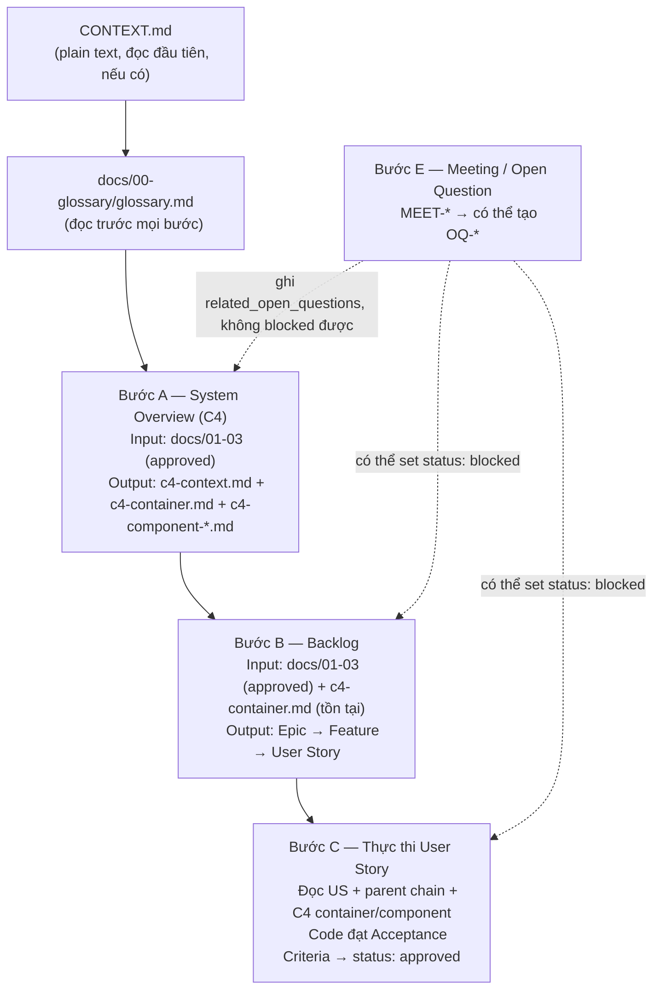
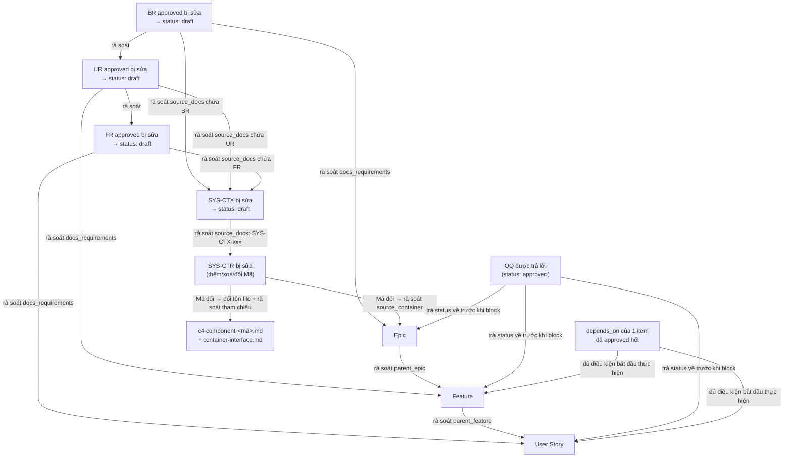

# AGENTS.md — Hướng dẫn cho Agent khi làm việc với Spec Kit này

## Nguyên tắc chung
1. LUÔN đọc `CONTEXT.md` và `docs/00-glossary/glossary.md` trước khi xử lý bất kỳ tài liệu nào — `CONTEXT.md` giới thiệu kit + thành phần chính, không phải nơi nháp WHY/WHO/WHAT (dùng skill `setup-context` để ghi thẳng vào BR/UR/FR).
2. KHÔNG bỏ qua tầng ở BR → UR → FR → System Overview: chỉ sinh tài liệu ở tầng N+1 khi tài
   liệu tầng N có `status: approved` (xem bảng vòng đời status ở `CLAUDE.md`). Tầng backlog
   (Epic → Feature → User Story) KHÔNG bị chặn bởi status của tầng
   cha — được phép thêm Feature/User Story mới vào một Epic/Feature đang `draft` bất kỳ lúc nào
   (backlog grooming là việc liên tục), miễn `parent_*` trỏ đúng và `status: deprecated` thì
   không thêm con mới nữa.
3. Mọi tài liệu mới phải điền đủ **toàn bộ** field frontmatter đúng theo `template.md`/
   `*-template.md` của loại tài liệu đó — KHÔNG chỉ `id`/`type`/`status`/`version`/`parent_*`
   (danh sách này không đầy đủ, mỗi loại có thêm field riêng, ví dụ: Epic/Feature/US còn có
   `docs_requirements`, `blocked_by_open_questions`; Feature/US thêm `depends_on`, `priority`;
   User Story thêm `story_points`, `assignee`; SYS-CTX/CTR/CMP/IFC có `source_docs` (SYS-CTR có
   thêm `source_container` ở Epic); OQ có `raised_in_meeting`, `blocks`). Không tự bỏ field nào
   có trong template dù thấy chưa cần ngay lúc tạo — để giá trị rỗng đúng kiểu (`[]`, `null`),
   không xoá field. Template của từng loại là nguồn duy nhất cho danh sách field bắt buộc —
   danh sách ví dụ ở trên chỉ để tránh nhầm với 5 field chung, không thay thế việc đọc
   template.
4. Nếu một **Epic/Feature/User Story/Open Question** liên quan tới `OQ-xxx` khác chưa được trả
   lời (`status: draft`), set `status: blocked` thay vì tiếp tục. BR/UR/FR/SYS-CTX/SYS-CTR/
   SYS-CMP/SYS-IFC/SYS-SIC KHÔNG có trạng thái `blocked` — dùng `related_open_questions` thay vì
   `blocked_by_open_questions`, không tự chặn tiến độ (xem `CLAUDE.md`, Bước E bên dưới).
   **Không tự cascade `blocked` lên Feature/Epic cha** khi 1 User Story con bị block — "liên
   quan tới OQ-xxx" ở trên chỉ áp dụng cho item thực sự liên quan trực tiếp tới OQ đó, không suy
   ra từ việc con của nó bị block. Nếu toàn bộ US con của 1 Feature đều `blocked`, Feature đó vẫn
   giữ nguyên `status` hiện tại (thường là `draft`) — "không còn US nào làm được ngay" không
   đồng nghĩa "Feature bị chặn"; xem skill `backlog-status` để biết cách hiển thị trường hợp này
   khi tổng hợp backlog.
5. Spec-kit này dừng ở User Story — không có tầng Task kỹ thuật, Sprint, hay Release riêng.

## Quy trình theo bước

### Bước A — Sinh System Overview (C4)
Input: `docs/00-glossary/glossary.md` (thuật ngữ dự án, đảm bảo đặt tên container/component
đúng ngữ cảnh) và toàn bộ `docs/01-business-requirement`, `02-user-requirement`,
`03-functional-requirement` (status = approved).
Output: `docs/04-system-overview/c4-context.md`, `c4-container.md`, và 1 `c4-component-*.md`
cho mỗi container có codebase thực sự (xem skill `c4-model`). Không sinh Code diagram (Level 4)
trừ khi được yêu cầu rõ ràng.

Khi giao tiếp giữa 2 container có dữ liệu thật cần thống nhất trước (để 2 container do 2
phiên/agent khác nhau thực thi không lệch schema), tạo thêm
`docs/04-system-overview/container-interface.md` (`SYS-IFC-xxx`,
mỗi luồng gán 1 mã `CIC-xxx` cục bộ trong file
đó — xem skill `c4-model`) — chỉ chốt schema dữ liệu (field nào bắt buộc/tuỳ chọn, kiểu ở mức
khái niệm — text/số/ngày-giờ/boolean/enum, dữ liệu cần
gửi/lưu, dữ liệu cần nhận lại/đọc), xác định từ Container/
Component diagram đã có, KHÔNG thiết kế API hay DB cụ thể (method HTTP, path, status code, tên
bảng/cột/kiểu SQL) — kể cả với container DB thuần. Đó là Code (Level 4), quyết định ở Bước C.

Nếu nhiều entity dùng chung bởi nhiều CIC/container mà mô tả rời rạc trong từng CIC sẽ bị lặp
hoặc lệch nhau, tạo thêm `docs/04-system-overview/entity-interface.md` (`SYS-SIC-xxx`,
xem skill `c4-model`) — định nghĩa entity, field (kiểu khái niệm), và quan hệ giữa các entity
(1-nhiều, nhiều-nhiều, đệ quy...) ở mức logic, độc lập công nghệ lưu trữ. Không bắt buộc cho mọi
hệ thống — hệ thống ít entity/quan hệ rời rạc thì field list trong từng CIC là đủ. Tài liệu này
không thay thế `container-interface.md`: đây là nguồn sự thật cho hình dạng entity,
CIC là nguồn sự thật cho thao tác nào gửi/nhận entity đó qua luồng nào.

### Bước B — Sinh Backlog
Input: `docs/01-03` (đã approved) và `docs/04-system-overview/c4-container.md` đã tồn tại
(không bắt buộc `status: approved`, nhưng phải có bảng "Danh sách container" để tra
`source_container` — xem skill `plan-backlog`).
Output theo thứ tự: Epic → Feature → User Story, mỗi cấp dùng đúng template
trong `docs/05-backlog/*/`. Liên kết `parent_*` bắt buộc. Epic nằm phẳng trong
`docs/05-backlog/epics/`; Feature/User Story nằm trong subfolder theo Epic sở hữu (xem
`CLAUDE.md`, mục "Đặt tên, ID và versioning") — không tạo phẳng chung 1 thư mục. Tiêu chí
phân rã từng cấp (Epic/Feature/User Story) và dấu hiệu User Story đủ nhỏ/đủ rõ: xem skill
`plan-backlog`.

**Phụ thuộc giữa Feature/User Story** (khác với `blocked_by_open_questions`): field
`depends_on` trên Feature/US ghi ID của (các) item khác phải `status: approved` trước khi
item này được coi là thực hiện được. Đây không phải trạng thái `blocked` — không cần
`blocked_by_open_questions`, không cần ai quyết định gì, chỉ đơn giản là "chưa tới lượt" và tự
hết khi dependency xong. Không bắt đầu thực hiện (Bước C) một User Story khi `depends_on` của
nó còn ID chưa `approved`.

**Epic ứng với container nào?** Không tự đặt mã container mới ở bước này — số lượng và mã hệ
thống đã được chốt từ Bước A (`c4-container.md`, cột "Mã"). Đối chiếu "Mục tiêu" của Epic với
cột "Trách nhiệm" của từng container trong bảng đó:
- Khớp đúng 1 container → lấy "Mã" của container đó cho `source_container` của Epic.
- Khớp Trách nhiệm của nhiều container (Epic cần nhiều hệ thống phối hợp) → tách thành nhiều
  Epic, mỗi Epic ứng với 1 `source_container`, cùng trỏ `docs_requirements` về BR gốc.
- Không container nào khớp → `c4-container.md` đang thiếu/lỗi thời, quay lại Bước A cập nhật
  container diagram trước, không tự bịa container ở backlog.

**"Backlog"** không phải 1 file riêng — đó là trạng thái gộp của mọi Epic/Feature/User Story
trong `docs/05-backlog` đang `draft` và không `blocked` (chưa `approved` nghĩa là chưa xong).
Ưu tiên xử lý: loại các item đang `blocked` trước, còn lại sắp theo field `priority` trên
Feature/US (`P0` xử lý trước, `P3` sau cùng).

**`priority` khác gì với "Ưu tiên" (MoSCoW) ở UR?** Hai lớp riêng biệt, không dùng thay cho
nhau:
- MoSCoW ở UR (`Must/Should/Could/Won't have`) là ưu tiên **của yêu cầu**, chốt 1 lần lúc UR
  được approve, hiếm khi đổi.
- `priority` (`P0`-`P3`) trên Feature/User Story là ưu tiên **xử lý trong backlog**, có thể
  khác giá trị suy ra từ MoSCoW gốc vì bối cảnh thay đổi (deadline khách hàng, rủi ro kỹ thuật
  mới phát sinh...).

Khi tạo mới Feature/US ở Bước B, suy `priority` mặc định từ mức MoSCoW của UR nguồn: `Must
have` → `P0`/`P1`, `Should have` → `P1`/`P2`, `Could have` → `P2`/`P3`, `Won't have` → không
đưa vào backlog. Nếu `docs_requirements` của Feature/US trỏ tới **nhiều UR có mức MoSCoW khác
nhau** (qua FR trung gian) → lấy mức MoSCoW **cao nhất** trong các UR nguồn đó làm cơ sở suy
`priority` (ví dụ 1 UR `Must have` + 1 UR `Should have` → tính như `Must have`, không lấy trung
bình hay mức thấp nhất) — item đã phục vụ 1 nhu cầu bắt buộc thì vẫn bắt buộc dù còn phục vụ
thêm nhu cầu khác ít quan trọng hơn. Mỗi mức MoSCoW ứng với 2 giá trị `priority` liền kề, không
phải 1 — tiêu chí chọn giữa 2 giá trị đó (đúng 1 trong 3 nhánh, không nhánh nào cần suy đoán
thêm):
- Item **chặn** các Feature/US khác (nằm trong `depends_on` của item khác) hoặc thuộc
  container/luồng chính đang triển khai đầu tiên → lấy giá trị cao hơn (`P0` cho `Must have`,
  `P1` cho `Should have`...).
- Item tự nó có `depends_on` trỏ tới item khác, và không có item nào khác `depends_on` nó (không
  chặn ai) → lấy giá trị thấp hơn liền kề — hợp lý vì nó "chưa tới lượt" theo đúng cơ chế
  `depends_on`, không cần xử lý sớm hơn các item chặn người khác.
- Item không có quan hệ `depends_on` theo chiều nào (không chặn ai, không chờ ai) → lấy giá trị
  thấp hơn liền kề theo mặc định; chỉ lấy giá trị cao hơn nếu có lý do nghiệp vụ cụ thể khác
  (deadline khách hàng, rủi ro kỹ thuật...) — ghi lý do đó vào "Ghi chú".

Không bắt buộc ghi lý do vào "Ghi chú" khi **chọn lần đầu** giữa 2 giá trị hợp lệ lúc tạo mới
(áp dụng đúng 1 trong 3 nhánh trên là đủ) — chỉ bắt buộc ghi lý do khi **sau này đổi** `priority`
khác giá trị đã chọn ban đầu. Review định kỳ `priority` của các item đang `draft` (chưa
`approved`) — có thể điều chỉnh nếu bối cảnh thực tế khác lúc tạo, nhưng phải ghi lý do đổi vào
mục "Ghi chú"/"Ghi chú kỹ thuật" của item đó.

Các dải giá trị `priority` suy ra từ 2 mức MoSCoW liền kề **chồng lấn có chủ đích** (`P1` đạt
được từ cả `Must have` lẫn `Should have`, `P2` từ cả `Should have` lẫn `Could have`) — không suy
ngược được mức MoSCoW gốc chỉ từ 1 mình giá trị `priority`. Đây là đặc tính thiết kế, không phải
lỗi cần thu hẹp dải: cần biết mức MoSCoW gốc thì lần theo `docs_requirements` tới UR liên quan
rồi đọc mục "Ưu tiên" (MoSCoW) của UR đó trực tiếp — không suy đoán ngược từ `priority` một
mình. Số hop khác nhau giữa Feature và User Story vì `docs_requirements` trỏ tới tầng khác nhau
(xem `plan-backlog`): Feature → `docs_requirements` trỏ thẳng tới UR, 1 hop. User Story →
`docs_requirements` trỏ tới FR, phải thêm 1 hop qua `parent_user_requirement` của FR đó mới tới
UR (US → FR → UR), không phải US → UR trực tiếp. Mục "Ghi chú" chỉ chắc chắn có thông tin khi
`priority` từng bị đổi sau này (xem trên) — không phải nguồn để tra MoSCoW gốc cho item chưa
từng đổi `priority`.

**Ví dụ minh hoạ** (một luồng xuyên suốt, rút gọn):
`BR-001` "Tăng tỉ lệ chuyển đổi checkout" → `UR-001` "Khách hàng mua sắm online, pain point:
phải nhập lại thông tin thẻ mỗi lần mua" → `FR-001` "Hệ thống phải hỗ trợ thanh toán 1-click
cho thẻ đã lưu" → `EPIC-001` "Checkout nhanh" (`source_container: checkout-api`) → `FEAT-001` "Thanh
toán 1-click" → `US-001` "Là khách hàng đã lưu thẻ, tôi muốn thanh toán 1 chạm để không phải
nhập lại thông tin" (Acceptance Criteria điền đầy đủ, bao phủ edge case ngay lúc tạo). Khi
`US-001` đã `draft`, đủ rõ để làm và không `blocked`, agent (hoặc dev) bắt đầu thực hiện
(Bước C).

### Bước C — Thực thi User Story
**Agent làm việc trong repo spec-kit này KHÔNG được tự viết/sửa code ứng dụng** — kit này
không có code (xem `CLAUDE.md`). Nếu user yêu cầu implement trực tiếp tại đây, dừng lại và
nhắc: việc code nằm ngoài phạm vi spec-kit này. Bước C chỉ mô tả agent thực thi cần đọc gì từ
repo spec-kit này trước khi code, và cập nhật gì lại đây sau khi code xong.

Trước khi code, đọc theo thứ tự:
1. `docs/00-glossary/glossary.md`
2. File User Story hiện tại — mục "Context cho Agent" nếu có (US tạo trước khi mục này có
   trong template có thể chưa có; khi đó đi thẳng bước 3)
3. `parent_feature` → các FR trong `docs_requirements`
4. `docs/04-system-overview/c4-container.md` (container liên quan), và `c4-component-<mã
   container>.md` của container đó nếu file này tồn tại (container đơn giản, không có cấu
   trúc nội bộ đáng vẽ, sẽ không có file Component — xem skill `c4-model`)
5. `docs/04-system-overview/container-interface.md` nếu tồn tại — mục CIC-xxx tương
   ứng luồng giao tiếp qua container liên quan, tránh tự bịa field khác với container ở đầu kia
   đã thống nhất
6. `docs/04-system-overview/entity-interface.md` nếu tồn tại — entity liên quan (field
   + quan hệ), đặc biệt khi CIC ở bước 5 trỏ về entity trong tài liệu này thay vì liệt kê lại
   field

### Bước E — Xử lý Meeting/Open Question
Khi có input từ cuộc họp: tạo `MEET-*`, nếu phát sinh điều chưa rõ → tạo `OQ-*`
(`status: draft`) và cập nhật `blocked_by_open_questions` + `status: blocked` trên các
Epic/Feature/Story liên quan (SYS-CTX/SYS-CTR không có `blocked` — chỉ ghi
`related_open_questions`, không tự chặn tiến độ, xem `CLAUDE.md`).

`OQ-*` bắt buộc field `raised_in_meeting` trỏ về 1 `MEET-*` có thật — không tạo OQ mà chưa có
meeting note tương ứng. Nếu điều chưa rõ phát sinh ngoài 1 cuộc họp chính thức (trao đổi trực
tiếp, phát hiện lúc review), vẫn tạo `MEET-*` ngắn ghi lại bối cảnh đó trước, rồi mới tạo `OQ-*`
trỏ về nó — không bỏ qua bước này chỉ vì "không phải cuộc họp thật".
Không tự suy đoán câu trả lời cho open question — chỉ ghi nhận. Khi OQ được trả lời: điền
mục "Trả lời" trong `OQ-xxx`, set `status: approved`, rồi gỡ block trên mọi item liệt kê
trong `blocks: []` của OQ đó — đưa `status` của từng item quay về trạng thái **trước khi bị
block** (không mặc định về `draft`; xem `OQ-template.md`). Item bị block có thể là
Epic/Feature/Story.

**Họp làm thay đổi Feature/User Story** — phân biệt 2 trường hợp:
- Thay đổi **chưa chốt**, còn cần quyết định → xử lý như open question bình thường ở trên: tạo
  `OQ-*`, set `blocked_by_open_questions` + `status: blocked` trên item liên quan.
- Thay đổi **đã chốt ngay tại họp** (không cần OQ) → sửa thẳng Feature/User Story bị ảnh hưởng
  (tăng `version`, cập nhật `last_updated`), ghi lý do + liên kết `MEET-xxx` vào mục "Ghi chú"/
  "Ghi chú kỹ thuật" của item đó:
  - Item vẫn `draft` (chưa thực hiện xong) → sửa thẳng nội dung cho khớp.
  - Item đã `approved` (đã thực hiện xong) → KHÔNG sửa ngược item đã hoàn thành (phá
    traceability của việc đã xong); tạo Feature/User Story mới cho phần chênh lệch,
    `parent_*` trỏ về đúng Epic/Feature liên quan.

## Ma trận lan truyền thay đổi

Không có cơ chế tự động (không hook, không CI) — mọi lan truyền dưới đây đều cần agent/người
chủ động rà soát khi thấy 1 tài liệu chuyển sang trạng thái kích hoạt (`draft` trở lại sau
`approved`, `blocked`, container đổi Mã, OQ được trả lời, `depends_on` hoàn tất...). Ghi lại việc
đã rà soát trong message của commit đưa tài liệu về lại `approved` (ví dụ: "reviewed UR-001,
SYS-CTX-001, EPIC-001/002 — no downstream change needed") — kit này không có dashboard/log riêng
để tra lại việc rà soát đã xảy ra hay chưa, git log là nơi duy nhất giữ lại bằng chứng đó. Sơ đồ
này chỉ để tra cứu nhanh "sửa cái này thì phải xem lại cái gì" — không thay thế nội dung chi tiết
ở Bước A–C, E phía trên.

| Nguồn thay đổi | Cần rà soát/cập nhật | Chi tiết ở đâu |
|---|---|---|
| BR đã `approved` bị sửa nội dung → `status: draft` | UR con (`parent_business_requirement`), SYS-CTX có `source_docs` chứa BR đó, Epic có `docs_requirements` chứa BR đó | Nguyên tắc chung #2; sau khi rà soát xong mới đưa BR về lại `approved` |
| UR đã `approved` bị sửa → `status: draft` | FR con, SYS-CTX (`source_docs`), Feature (`docs_requirements`) | như trên |
| FR đã `approved` bị sửa → `status: draft` | SYS-CTX (`source_docs`), User Story (`docs_requirements`) | như trên |
| SYS-CTX đã `approved` bị sửa → `status: draft` | SYS-CTR có `source_docs: [SYS-CTX-xxx]` | Bước A |
| SYS-CTR đổi (đổi/xoá Mã của 1 container) | Epic có `source_container` trỏ tới Mã đó — cập nhật lại `source_container`, hoặc báo "liên kết gãy" nếu Mã bị xoá. Đồng thời: file `c4-component-<mã cũ>.md` (tên file chứa Mã) cần đổi tên theo Mã mới, và mọi tham chiếu tới Mã đó trong `container-interface.md` (cột "Từ"/"Tới" ở mục "Bảng tổng hợp CIC" và các mục CIC chi tiết) cần cập nhật — không rà soát 2 chỗ này thì tài liệu vẫn tham chiếu Mã đã lỗi thời | Bước B, mục "Epic ứng với container nào?"; Bước A cho file Component/Container Interface Contract |
| Feature/User Story đổi trong cuộc họp | User Story liên quan — còn `draft` thì sửa thẳng, đã `approved` thì tạo item mới cho phần chênh lệch | Bước E, mục "Họp làm thay đổi Feature/User Story" |
| OQ được trả lời (`status: approved`) | Mọi item trong `blocks: []` của OQ đó — trả `status` về trạng thái trước khi bị block | Bước E |
| `depends_on` của 1 item đã `approved` hết | Chính item đó — có thể xét bắt đầu thực hiện (Bước C, vẫn cần review, không tự động) | Bước B, mục "Phụ thuộc giữa Feature/User Story" |
