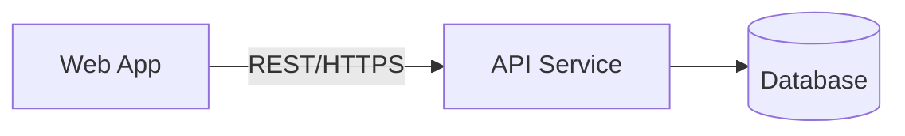

# Container Diagram (C4 Level 2)

> Audience: kỹ thuật (architect, developer, ops). Cho thấy các container và công nghệ.

## Danh sách container
Cột "Mã" là slug ngắn, duy nhất trong bảng này (vd `checkout-web`, `checkout-api`, `db`) —
Epic tham chiếu tới container qua đúng mã này (field `source_container`), không dò theo tên
hay câu chữ ở cột Trách nhiệm. Cột "Repo triển khai" để trống nếu container không có repo
riêng (DB, service bên thứ 3, hoặc chung repo với container khác trong monorepo thì ghi cùng
1 tên repo).

| Mã | Container | Loại (web app / mobile / DB / service...) | Công nghệ | Trách nhiệm | Repo triển khai |
|---|---|---|---|---|---|

## Giao tiếp giữa các container
| Từ | Đến | Giao thức | Mô tả |
|---|---|---|---|

## Diagram (mermaid)

## Ghi chú
- Chỉ dừng ở mức Container. Component/Code diagram (Level 3-4) chỉ tạo khi cần drill-down
  vào 1 container cụ thể, theo yêu cầu của team phụ trách container đó.
