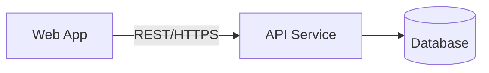

# Container Diagram (C4 Level 2)

> Audience: kỹ thuật (architect, developer, ops). Cho thấy các container và công nghệ.

## Danh sách container
| Container | Loại (web app / mobile / DB / service...) | Công nghệ | Trách nhiệm |
|---|---|---|---|

## Giao tiếp giữa các container
| Từ | Đến | Giao thức | Mô tả |
|---|---|---|---|

## Diagram (mermaid)

## Ghi chú
- Chỉ dừng ở mức Container. Component/Code diagram (Level 3-4) chỉ tạo khi cần drill-down
  vào 1 container cụ thể, theo yêu cầu của team phụ trách container đó.
