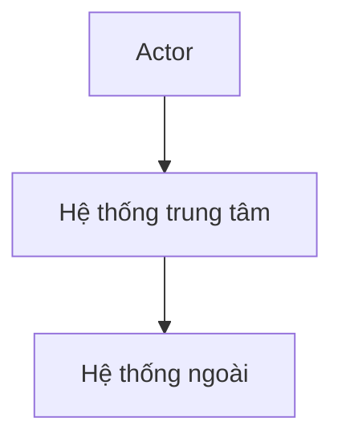

# System Context Diagram (C4 Level 1)

> Audience: mọi người (technical + non-technical). Không đi vào chi tiết kỹ thuật.

## Hệ thống
<Tên hệ thống> — <mô tả 1-2 câu>

## Actors / Personas
| Actor | Vai trò | Tương tác với hệ thống |
|---|---|---|
| | | |

## Hệ thống bên ngoài liên quan
Để trống bảng và bỏ node `ExtSys` khỏi diagram bên dưới nếu hệ thống không tích hợp với bất kỳ
hệ thống ngoài nào (ví dụ MVP standalone) — không bắt buộc phải có ít nhất 1 dòng.

| Hệ thống ngoài | Mục đích tích hợp | Hướng dữ liệu (in/out) |
|---|---|---|

## Diagram (mô tả hoặc mermaid)

